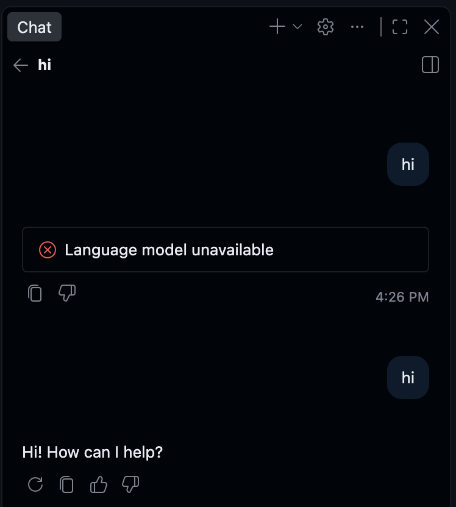
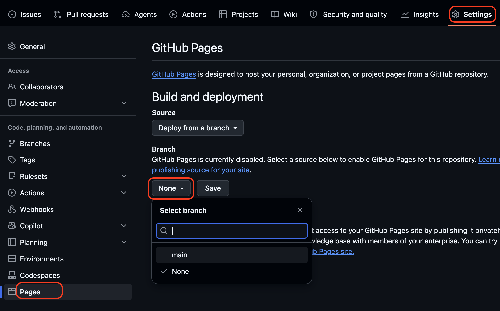

# AI辅助软件开发流程 Camp

**设备要求**：Chromebook、iPad 或普通电脑（带键盘或语音输入）。
**软件要求**：只需要现代浏览器。
**课前必备**：GitHub 账号，推荐订阅copilot。

---

## Session 1: 开启云端IDE

**目标**：创建项目库，打开云端编辑器，并用 AI 写出第一行代码。

### 00:00 - 05:00 概念引入

- GitHub：分享（open source）和合作（version control）软件项目的平台网站，业界最大。
- repo：项目文件夹
- Codespace：项目编辑器（IDE）
- GitHub Page：项目的网站

### 05:00 - 15:00 动手准备：建立项目，打开编辑器

**老师投屏带领，学生同步操作：**

1. 打开浏览器，访问 `github.com` 并确保已登录。
2. 点击页面右上角的 **绿色按钮 [New]**（或者左上角的 `+` 号选择 `New repository`）。
3. 在 **Repository name** 框里，输入一个英文小写名字，比如 `my-first-magic`（可以随便敲字母）。
4. 向下滚动，**必须勾选 [Add a README file]**（非常重要！这能让我们的工坊顺利启动）。
5. 点击页面最下方的 **绿色按钮 [Create repository]**。
6. 在新页面中，点击绿色的 **[<> Code]** 按钮。
7. 在弹出的菜单中，点击 **[Codespaces]** 标签页。
8. 点击绿色的 **[Create codespace on main]**。
* *提示学生：此时页面会变成黑色，开始加载。*

### 15:00 - 30:00 召唤 AI：写下 Hello World

**在 Codespace 界面中操作：**

1. 开始会话。右侧的聊天窗口中说 “Hi”，
    - 这时会弹出登陆窗，用你的GitHub账户登陆
    - 登陆后 Agent 会予以回应
    - 如果报错为 “Language model unavailable”，登陆后再试
        
2. 开始写网页。给 agent 说：`请写一个 Github Page 网页，内容是 "Hello World!"`
    - 内容自拟，不一定是非要一样
3. 检查网页
    - 在 terminal 里打 `python -m http.server`，以运行网页
    - Ctrl/Cmd + 点击下面链接 `http://0.0.0.0:8000/`
    - 会打开一个新标签页，里面是你想要的内容。
    - 如果不满意，还可以和agent聊天叫它修改
    - 满意就 [Keep]
    - Ctrl + C 停止运行
4. 发布网页
    - 给 agent 说：`请将当前修改推送（push）到 Github`
        - 一直 Allow
    - 回到Github repo界面，点击Settings标签
    - 左侧选择 Pages
    - Branch 选择 main，然后 Save
        
        - 之后你会在 page 界面看到你的网页的链接
        - 首次发布和每次修改都要等几分钟才能看到最新的版本

### 30:00 - 40:00 展示成果

你已经发布了一个自己的网页！快把链接发给老师和同学看看吧。
- 老师收集学生的网页链接备份

### 工具替换

推荐使用付费Agent，以避免一些无意义的问题情况。除了GitHub 付费以外，也可以使用ChatGPT或claude的付费用户，需要下载对应插件并在插件内登陆。
- ChatGPT 用户下载 Codex 插件
- Claude 用户下载 Claude 插件

运行网页也可以使用 live server 插件，而不是python命令，比较方便。

### 可能的情况

因为Agent行为不可预测，所以会有一些情况。

- 老师和助教最好熟悉 Github 相关概念，即使并不教学生使用，但可以帮学生 debug
    - mian branch
    - commit
    - push
- 请确保模式是 Agent 而不是其他，这个模式会尽可能自动执行任务
- 在简单的Camp里一路 Allow/keep 是常态，因为在云端，即使出错也不会导致电脑崩溃
    - 但并不是说一定不会出错，但一这个级别的camp一般出错就重做就好了

---

## Session 2: 软件设计（不碰电脑）

**目标**：完成 App 的构思与逻辑梳理。本节课主要使用纸笔。

发给每个孩子一张纸，包含以下填空
1. **我的 App 名字叫**：____________________
2. **屏幕上长什么样？（有什么颜色的按钮？什么图片？）**：____________________
3. **游戏规则（核心逻辑）：当我点击 [某东西] 的时候，它会发生 [什么变化]？**：____________________

### 00:00 - 10:00 说明边界

老师说明程序的能力边界。
- 只是网页
- 不涉及复杂图形，比如大型3D游戏做不了（主要瓶颈其实是性能）
- 不涉及将数据长期保存在网上，比如做不了facebook
- 不涉及多方通信，比如做不了discord

#### 面对初阶学生

如果学生对电脑的基本概念还模糊，或者年纪较低接受能力有限，我们并不一次将网页的全部的能力都介绍给学生。也是为了减少老师和助教的工作，我们将主题限制在一定的范围内。

推荐
- 处理文字，数字
    - 比如手账本
    - 计算器
    - 时钟日历
- 处理几何图形
    - 比如几何风格的游戏
        - 俄罗斯方块
        - 吃豆人
        - 打地鼠
    - Spirograph Simulator
    - 力学仿真（模拟一个天平，模拟齿轮）
- 简单逻辑游戏
    - simon game
    - 猜数字
    - 桌游，棋牌类游戏，但是你自己的规则

#### 面对高阶学生

其实单一网页就可以做到很多事情，如果老师和助教熟悉相关功能，且学生的接受能力强（比如高中生），完全可以加入。

而且最有用的部分是，当老师和助教也不熟悉某项功能时，完全可以先向AI提问可能性和用法。这里给出一些思路。

- 如果需要从外界获取信息，就问AI请问有没有免费的API可以获取XXX，如果AI找到就先叫AI尝试获取一下，如果结果满意就用在网易里。这类信息比如说
    - 天气
    - 地图
    - 随机的名言警句
- 如果需要两两联机，用pin链接，告诉AI使用 WEBrtc peerjs + 6位 pin。可用于对战游戏
- 如果需要打开本地文件，告诉AI使用 FileAccessAPI，用于开发文本或图片编辑器
- 如果开发游戏可以告诉AI使用 WebGL，这不是必须的，但是可以提高游戏的性能
- 如果需要保存少量本地数据，比如设置等，可以告诉AI数据保存在 Local Storage
- 网页也可以调用设备硬件，比如摄像头和麦克风
- 如果是想在手机上使用，告诉AI对移动设备优化。包括竖屏显示和触摸屏。

### 10:00 - 40:00 学生设计

当学生设计好后，举手叫老师助教审阅。
老师批准过的学生相互介绍自己的设计。

#### 设计要求

- 需要逻辑完整，不要让 Agent 猜你的用意
    - 教师和助教主要就设计的细节把关
    - 如果设计过于ambitious但又缺乏细节，引导学生做一个简单的实验版本。
    - 对于高阶学生，引导学生使用 /grill-me 做最初的设计检查。
- 对个性化有最基本的要求
    - 不要学生复制一个已经有的软件，而要学生都完成一个独一无二的软件。即使是最没有想法的学生也要求在已有的构型上有微调。最不济了也要有审美上的变化。比如过
        - 逻辑微调：更改规则的国际象棋（需要非常仔细地描述规则）
        - 审美微调：手账本，但有仔细的布局设计（可照相后上传给AI）

关于逻辑完整，可以参阅[Beakman S2EP10](https://www.youtube.com/watch?v=TkSEcNv3FIU)

---

## Session 3: 实现代码

**目标**：将自然语言转化为代码，并跑通第一版程序。

### 00:00 - 10:00 上传设计

老师手把手带领
- 和Session 1一样，打开和AI的聊天
- 将之前的设计书拍照上传给AI，聊天说“按照这个需求实现一个 Github Page Web app，如果有不清楚的请先问我再写代码”
    - 低阶学生因为设计简单可以直接开始写代码
    - 稍高阶的学生使用 plan mode 让AI先消化设计书再写代码
- 和 Session 1 一样的方式检查输出的内容
- 很可能输出的内容不完全和学生预想的一样，这时就和AI再聊天告诉AI什么地方和预想的不一致。
- 如果出现 BUG 也可以叫AI修，比如白屏闪退之类的。
    - 高阶学生可以引导他们把 F12 console 里的报错发给AI
- 最后别忘了推送（push），方法和session1一样

### 10:00 - 40:00

从这里开始就进入了 [给AI提要求 -> AI 写代码 -> 检查生成的网页] 的循环。完全可以放手去叫学生自己做。

学生如果完成可以让教师助教检查。。
- 如果检查出了bug就让学生改。
- 如果还有大量时间，教师可以提出一个新的功能要求或者改进意见。
    - 最常见的改进意见是，要求学生加入说明
        - “如果一个人新打开你的网站，他知道该怎么玩/用你的app吗？”
    - 另一个改进意见是美化
        - 比如界面是蓝色的，可以说“我喜欢粉色可不可以加一个选项让我设置界面的颜色”

## Session 4: 用户反馈

### 00:00 - 10:00 说明

嘿，到了分享的时间了。

老师将全部学生的app 链接总结发布。
并开放一个意见板。

要求全部的学生试玩别人的app并给出反馈。
我们要给出 constructive 的反馈，就是开发者看了能改的那种。
我么使用固定句式“要是XXX能YYY，就可以满足我ZZZ的需求了”（主要是为了防止学生之间因为反馈引起矛盾）

学生也可以发给家长亲戚，邻居。

### 10:00 - 40:00 Share Party

每个 app 至少 获得1～2个评论。
评论匿名，如果有学生的 评论少，老师和助教要帮忙加入。

### Session 5: 迭代再版

### 00:00 - 10：00 说明

我么已经得到了一系列反馈，
这些都是真实的用户反馈。
我们现在根据这些反馈修改我们的app，
让它们变得更好。

### 10:00 - 40:00 实践

这个时间里不断修改app
教师和助教回到session 3的工作。
学生也可以通过自己不断游玩找到新的修改点。
即使学生沉迷于玩自己的或者其他人的作品，也没有关系，
这个camp的目标要学生树立delivery的成就感，这也是其中一个部分。